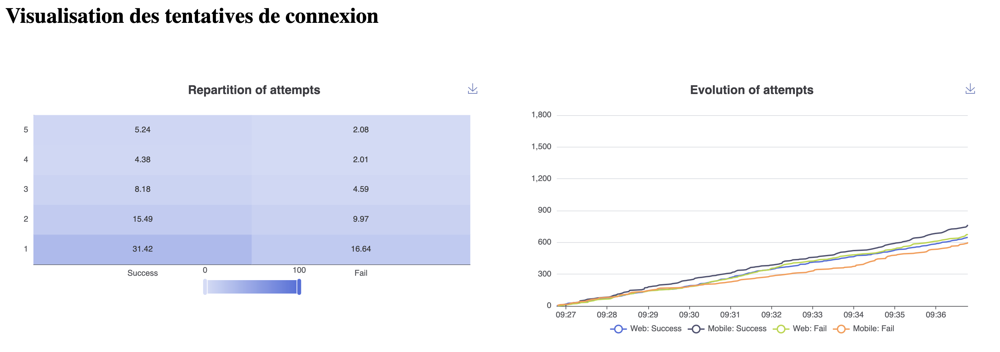

# Visualisation de tentative de connexion en temps rééls.

Vous devez développer un tableau de bord pour visualiser en temps réél les tentatives de connexion à un système bancaire.

Pour simplifier l'exercice nous considérons uniquement les informations suivantes pour une tentative de connexion :

- le succès ou l'échec de la tentative
- le numéro de la tentative dans l'heure (pour un identifiant d'utilisateur, après X échecs dans la dernière heure, la tenative suivante est X+1)
- la cible de la tentative : authentification à la plateforme web de gestion du compte (site web) ou authentification à la plateforme mobile (appli mobile)
- le timestamp : instant temporel au format ISO 8601

Un tentative d'authentification est modélisée dans un tableau de cette manière en JSON :

```json
["ISO8601 extended Datetime", <Boolean>, <Number>, <"W"|"M">]
```

Exemple de document :

```json
["2025-03-01T10:34:32.540Z", false, 2, "W"]
```

## Visualisations

2 visualisations doivent être fournies, prenant en compte les données des dix denières minutes et rafraichies toutes les deux secondes avec les dernière tentatives :

- Un graph en lignes avec une ligne par cible et succes de tentative (i.e.: "WEB-SUCCESS", "WEB-FAIL", "MOBILE-SUCCESS", "MOBILE-FAIL") :
  - en abscisse le temps ;
  - en ordonnée le nombre de tentativex ;
  - interactions possibles : 
    - filtrer les lignes (n'afficher qu'une ou certaines lignes) via la légende (un click sur la légende d'une ligne masque ou affiche cette dernière) ;
    - Exemple : [https://echarts.apache.org/examples/en/editor.html?c=line-stack](https://echarts.apache.org/examples/en/editor.html?c=line-stack).

- Une carte de chaleur, affichant le nombre de tentative par numéro de tentative et réussite
  - en abscisse le succès (SUCCESS / FAIL) ;
  - en ordonnée le numéro de tentatives (ordonnées du bas vers le haut) ;
  - les valeurs de la carte sont les pourcentages par rapport au nombre total de tentatives ;
  - interactions possibles : via la légende du gradient de valeur (de 0 à 100%) : 
    - mise en valeur des cases au dessus d'un certain pourcentage en positionnant la souris sur le gradiant ;
    - filtrage des valeurs affichées en changeant les bornes du grandient ;
    - Exemple : [https://echarts.apache.org/examples/en/editor.html?c=heatmap-cartesian](https://echarts.apache.org/examples/en/editor.html?c=heatmap-cartesian).

## Fonctionnalités

- Les tentatives récupérées doivent être sauvegardées (pour la dernière minute) dans un stockage local.
- les réglages de l'utilisateur sur les visualisation (filtrage).
- À l'ouverture de l'application :
  - On charge d'abord les tentatives du stockage local dont l'instant temporel est inclu dans la dernière heure ;
  - On charge les réglages de visualisation de l'utilisateur. 
- Une fois les tentatives chargées du stockage local (le cas échéant), le système doit :
  - requêter le serveur pour obtenir les dernières tentatives depuis l'instant le plus récent des tentatives locales exploitées (ou depuis la dernière heure à défaut) ;
  - mettre en place un système de long polling pour requêter toutes les 2 secondes les dernière tentatives depuis l'intant le plus récent de la dernière tentatives obtenue. Le serveur peut répondre sans donnée (code de retour HTTP 204) si aucune nouvelle tentative n'est disponible.
- À chaque récupération de nouvelles tentatives le système doit :
  - les enregistrer dans le stockage local ;
  - mettre à jour les visualisations.
- Si le navigateur ne propose pas de cache local, le fonctionnement doit tout de même être garanti.
- À chaque modification des filtres d'affichage par l'utilisateur, le système doit enregistrer ces réglagles dans le stockage local.

## Exemple de tableau de bord
